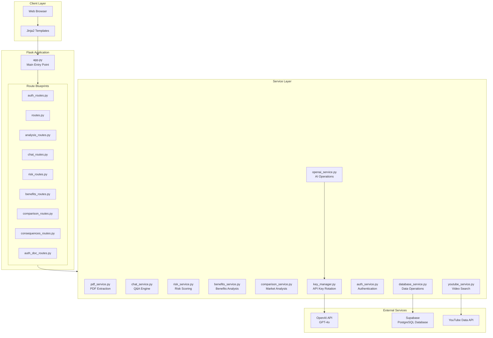
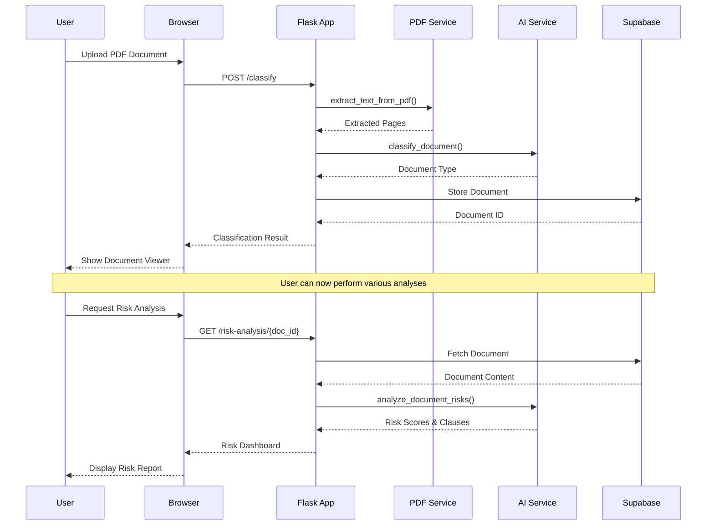
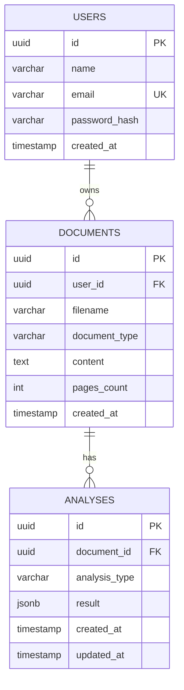
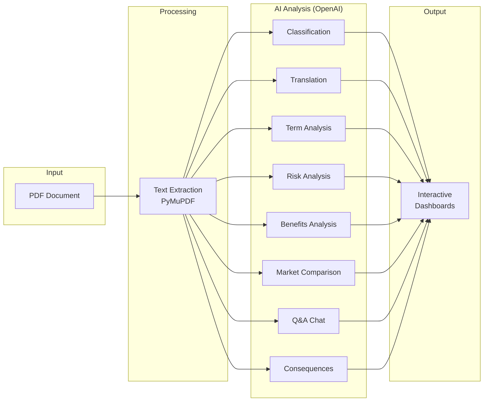

# ClarityVault

**AI-Powered PDF Document Analyzer & Intelligence Platform**

ClarityVault is a sophisticated Flask-based web application that leverages AI to help users understand, analyze, and compare legal and financial documents. Upload a PDF and get instant classification, translation, risk analysis, and conversational Q&A capabilities.


---

## Features

| Feature | Description |
|---------|-------------|
| **Smart Classification** | Auto-detect document types (contracts, loans, insurance, etc.) |
| **Multi-Language Translation** | Translate documents to any language |
| **Risk Analysis Dashboard** | Score risky clauses with severity ratings |
| **Benefits Analysis** | Highlight positive aspects and advantages |
| **AI Chat Assistant** | Ask questions about your documents |
| **Term Explanation** | Break down legal jargon into simple language |
| **Market Comparison** | Compare with market alternatives |
| **YouTube Integration** | Find related educational videos |
| **User Authentication** | Secure login with JWT tokens |

---

## System Architecture

### High-Level Architecture



---

### Request Flow Architecture



---

### Data Model



---

### AI Service Integration



---

## Project Structure

```
ClarityVault/
├── app.py                    # Main Flask application entry
├── config.py                 # Configuration settings
├── routes.py                 # Main document routes
├── auth_routes.py            # Authentication endpoints
├── auth_doc_routes.py        # Protected document routes
├── analysis_routes.py        # Term analysis endpoints
├── chat_routes.py            # AI chat endpoints
├── risk_routes.py            # Risk analysis endpoints
├── benefits_routes.py        # Benefits analysis endpoints
├── comparison_routes.py      # Market comparison endpoints
├── consequences_routes.py    # Consequences analysis endpoints
│
├── services/
│   ├── pdf_service.py        # PDF text extraction
│   ├── openai_service.py     # Core AI operations
│   ├── chat_service.py       # Conversational AI
│   ├── risk_service.py       # Risk scoring engine
│   ├── benefits_service.py   # Benefits analysis
│   ├── comparison_service.py # Market comparison
│   ├── database_service.py   # Supabase operations
│   ├── auth_service.py       # JWT authentication
│   ├── youtube_service.py    # YouTube integration
│   └── key_manager.py        # API key rotation
│
├── templates/
│   ├── index.html            # Landing/upload page
│   ├── login.html            # User login
│   ├── signup.html           # User registration
│   ├── dashboard.html        # User dashboard
│   ├── viewer.html           # Document viewer
│   ├── analysis.html         # Term analysis
│   ├── chat.html             # AI chat interface
│   ├── risk_dashboard.html   # Risk analysis UI
│   ├── benefits_dashboard.html # Benefits UI
│   ├── comparison.html       # Market comparison
│   └── consequences.html     # Consequences view
│
├── uploads/                  # Temporary file storage
├── requirements.txt          # Python dependencies
├── database_schema.sql       # Supabase schema
├── Procfile                  # Deployment config
└── render.yaml               # Render deployment
```

---

## Quick Start

### Prerequisites

- Python 3.9+
- OpenAI API Key
- Supabase Project (URL & Key)
- YouTube Data API Key (optional)

### Installation

```bash
# Clone the repository
git clone https://github.com/yourusername/ClarityVault.git
cd ClarityVault

# Create virtual environment
python -m venv venv
source venv/bin/activate  # On Windows: venv\Scripts\activate

# Install dependencies
pip install -r requirements.txt

# Set environment variables
cp .env.example .env
# Edit .env with your API keys
```

### Environment Variables

```env
SECRET_KEY=your-secret-key
OPENAI_API_KEYS=key1,key2,key3
SUPABASE_URL=https://your-project.supabase.co
SUPABASE_KEY=your-supabase-key
YOUTUBE_API_KEY=your-youtube-key
JWT_SECRET=your-jwt-secret
```

### Database Setup

Run the SQL schema in your Supabase SQL Editor:

```sql
-- See database_schema.sql for full schema
CREATE TABLE users (...);
CREATE TABLE documents (...);
CREATE TABLE analyses (...);
```

### Run the Application

```bash
python app.py
```

Visit `http://localhost:5000` in your browser.

---

## API Endpoints

| Method | Endpoint | Description |
|--------|----------|-------------|
| `POST` | `/classify` | Upload & classify PDF |
| `GET` | `/document/{id}` | Get document content |
| `POST` | `/translate` | Translate text |
| `POST` | `/chat/{doc_id}/ask` | Ask question |
| `GET` | `/risk-analysis/{id}` | Get risk analysis |
| `GET` | `/benefits/{id}` | Get benefits analysis |
| `GET` | `/comparison/{id}` | Get market comparison |
| `GET` | `/analyze/{id}` | Get term analysis |
| `GET` | `/consequences/{id}` | Get consequences |

---

## Technology Stack

| Layer | Technology |
|-------|------------|
| **Backend** | Flask 3.0, Python 3.9+ |
| **AI/LLM** | OpenAI GPT-4o |
| **Database** | Supabase (PostgreSQL) |
| **PDF Processing** | PyMuPDF (fitz) |
| **Authentication** | JWT, bcrypt |
| **Frontend** | Jinja2, HTML5, CSS3, JavaScript |
| **Deployment** | Render, Gunicorn |

---

## License

This project is licensed under the MIT License.

---

## Acknowledgments

- [OpenAI](https://openai.com/) for AI inference
- [Supabase](https://supabase.com/) for database services
- [Flask](https://flask.palletsprojects.com/) for the web framework

---

